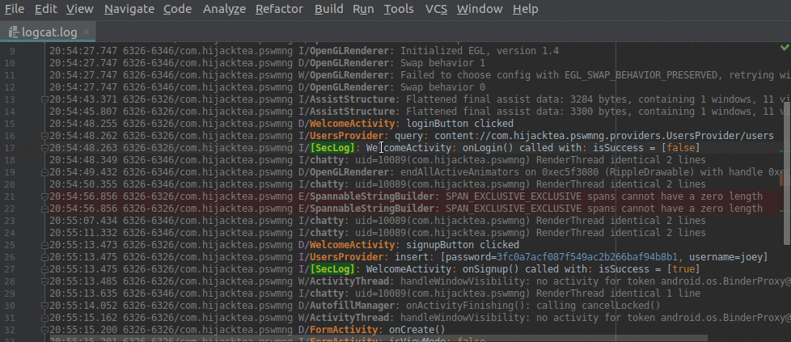
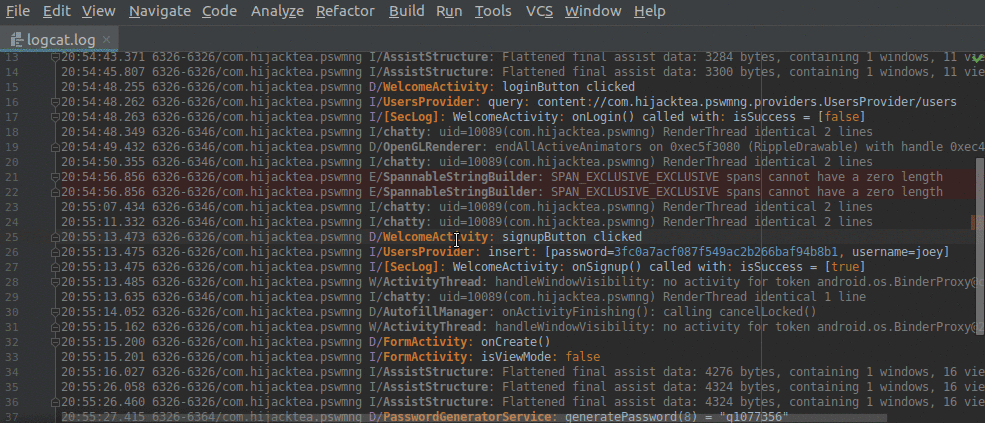
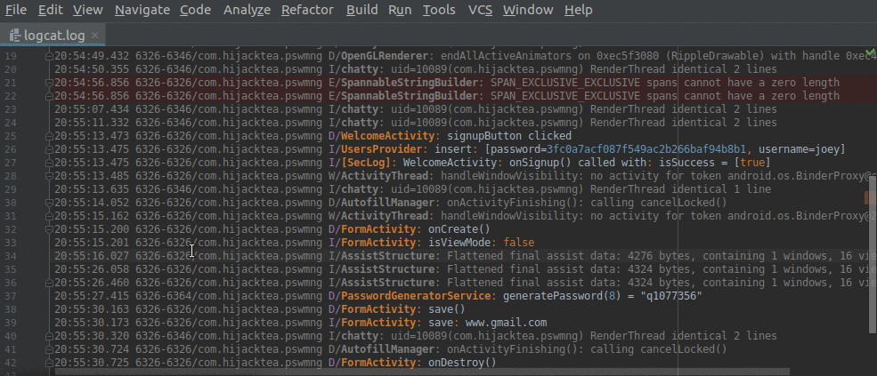
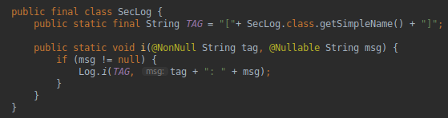
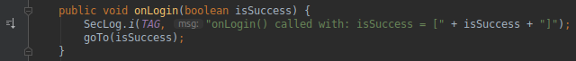
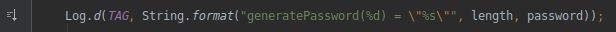
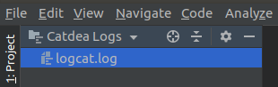

Catdea Plugin
===========

Catdea Plugin intended to match Android Logcat log entries with the source code that emit them, 
thereby providing navigation and interactivity, in order to simplify debugging or reverse engineering.

Plugin uses pre-compile-time calculations to identify log emitters in the source code, 
thus, no RegExp patterns required.

Features
------------
* Log files support
* Flexible log format\
Only _log level_, _tag_ and _message_ are required to provide navigation
* Navigation from _log_ entry to the _code_ that emit it, and vice versa\

* Syntax highlighting and colors settings available
* Highlighting of log entries\

* Unused (unmatched) log entries highlighting
* Folding support\

* Log _wrappers_ support\
Custom classes that _wrap_ `android.util.Log` like the following:\
\
will be recognized as log emitters:\

* Format strings support\

* Comment/uncomment log entry

* \[NEW!\] Logs in Project-view are grouped\

Changelog
------------
* 1.0.1 Added logs in Project-view
* 1.0 Initial release